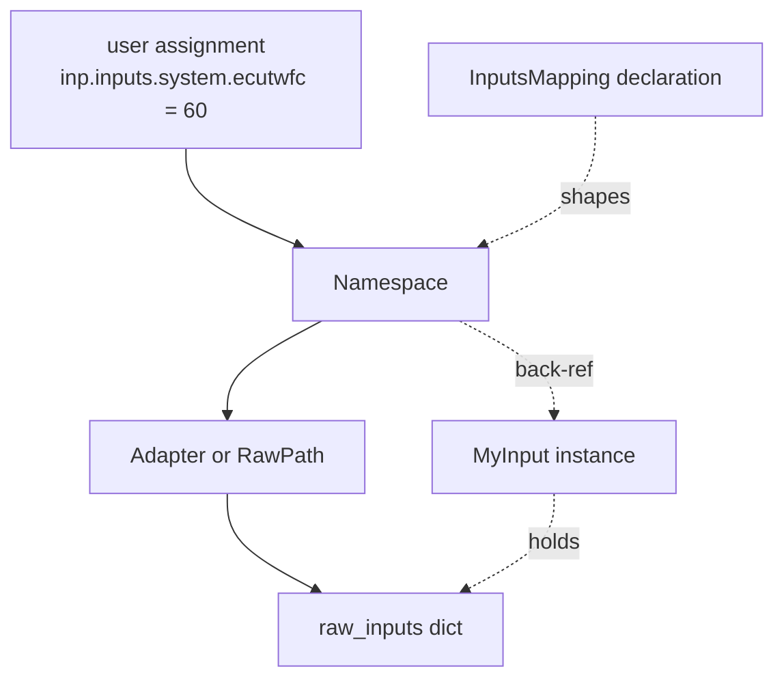
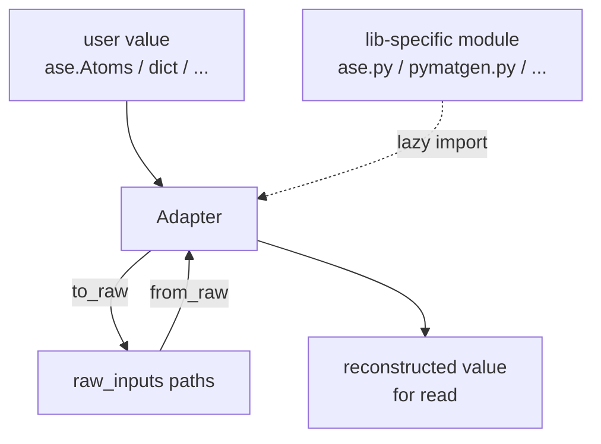
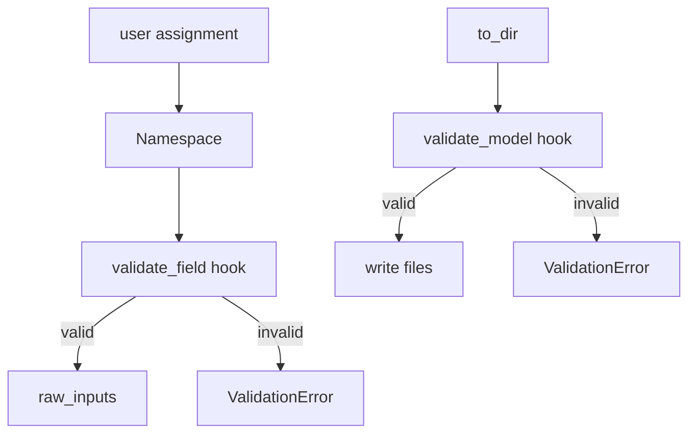

# Inputs — architecture

`dough` provides the generic machinery for declaring, validating, and writing the inputs of a simulation code as typed Python objects.
Code-specific packages (e.g. `qe-tools` for Quantum ESPRESSO) build on this machinery to ship the actual input classes, mappings, adapters, and parsers for their target code.

!!! note "Companion to the UX doc"

    This page describes the **architecture** behind the input layer.
    For the user-facing API and intended UX, see [Inputs](inputs.md).

Throughout, we use a hypothetical code with input class `MyInput` as a running example.

## Assigning



The diagram shows the four key pieces:

- `raw_inputs` — a plain nested dict, the **single source of state**, owned by the `MyInput` instance.
- **`InputsMapping`** — a class-level *declaration* of the typed surface (field names, types, adapters). Never instantiated directly.
- **`Namespace`** — runtime proxy presenting the typed surface and routing assignment through to `raw_inputs` via the adapters declared on the mapping. One class instantiated at two depths (top level for `inp.inputs`, nested for `inp.inputs.system`); depth controlled by a `path` parameter.
- **`Adapter`** — converts user values to/from the raw form. Trivial fields use an *implicit* `RawPath` adapter (the field name becomes the dot-path); complex fields (e.g. `structure`) hand-write their own `Adapter` subclass.

### One state, one source of truth

The mapping façade does **not store anything** of its own.
Every write path — attribute assignment (`inp.inputs.system.ecutwfc = 60`), `set_input`, `merge_inputs`, `from_dir`, `from_files` — runs through an adapter and assigns into `raw_inputs`.
Reading returns a value derived from `raw_inputs`; for adapter-backed fields this means re-deriving (e.g. reconstructing an `ase.Atoms` from the parsed cards).

This collapses three otherwise-tricky concerns into one:

- **No syncing**: there is no second copy of the data on the mapping that could drift.
- **No "what was set" ambiguity**: `raw_inputs` is the only thing that exists; what's in it is what gets written.
- **No persistence of user object identity**: assigning `inp.inputs.structure = atoms` converts and discards the reference; mutating `atoms` later has no effect on the input.

### One namespace per mapping, one mapping per typed API

A `Namespace` is a typed mapping (`InputsMapping`) attached to the input class as an attribute.
The default namespace is `inputs` (the code-native API).
Code-package developers can attach further namespaces — `common` for code-agnostic vocab, `protocols` for opinionated presets, ... — each with its own field set and adapters, all writing into the same `raw_inputs`.

```python
inp = PwInput()
inp.inputs.system.ecutwfc = 60         # qe-native API
inp.common.relax_type = "cell+atoms"   # common-workflow API, same raw_inputs
inp.to_dir("calc/")                    # writes the calculation directory
```

Last-write-wins on raw fields; namespaces do not coordinate.

### Two-level nesting

Nesting is capped at two levels: `inp.<namespace>.<group>.<field>`.
Cards with internal structure (Hubbard parameters, constraints, ...) are exposed as **lists of objects at level two**, not as a third namespace.
This keeps the mental model and the implementation small: a single `Namespace` class, instantiated at depth 0 (top level) or depth 1 (sub-mapping). No recursion beyond that.

## Declaring a mapping

Each input mapping is declared as a class decorated with `@input_mapping`:

```python
@input_mapping
class _SystemMapping:
    """The &SYSTEM namelist."""

    ecutwfc: float
    """Kinetic-energy cutoff for wavefunctions."""

    ecutrho: float | None
    """Kinetic-energy cutoff for charge density."""


@input_mapping
class _MyInputsMapping:
    """The default `inputs` namespace for MyInput."""

    structure: Annotated[Structure, StructureAdapter()]
    """Crystal structure. Accepts ASE / pymatgen / AiiDA / ..."""

    system: _SystemMapping
    """The &SYSTEM namelist."""
```

Two kinds of fields:

- **Adapter-backed leaves** — `Annotated[T, Adapter()]`. The adapter handles assignment and reading.
- **Sub-namespace fields** — bare annotation whose type is another `@input_mapping` class. The decorator injects a `SubMapping(...)` default; `BaseInput` resolves it into a nested `Namespace` (at depth 1) at construction.

Fields without an adapter or sub-mapping annotation are a declaration error.

The mapping class is connected to the input class via the generic typing syntax:

```python
class MyInput(BaseInput[_MyInputsMapping]):
    ...
```

`BaseInput` extracts the mapping class from this generic parameter at instantiation, walks its fields, and builds the `Namespace` proxies bound to `self`.

!!! note

    The `Annotated[T, Adapter(...)]` shape is the input analog of the output side's `Annotated[T, Spec(...)]`.
    Outputs use a one-way `Spec` (extract from `raw_outputs`), inputs use a two-way `Adapter` (assign + read).
    Future per-field metadata (e.g. a `Unit("eV")` marker mirroring the output side) slots in alongside `Adapter` in the same `Annotated` list.

## Adapters



An `Adapter` is a small object with two methods. Paths are dot-strings, glom-style (parity with the output `Spec`):

```python
class Adapter(Protocol):
    def to_raw(self, value: Any) -> dict[str, Any]: ...   # {"system.ecutwfc": 60}
    def from_raw(self, raw: dict) -> Any: ...
```

`to_raw` returns a flat mapping from dot-path to value; `BaseInput` writes each into `raw_inputs` via `glom`.
`from_raw` reads what it needs from `raw_inputs` and reconstructs a Python value for the user.

!!! note "Spec + Assign as primitives"

    The two adapter directions correspond directly to the two glom primitives:

    - **raw → typed (read)** = `glom.Spec(path)` — the same primitive the output side uses.
    - **typed → raw (write)** = `glom.Assign(path, value, missing=dict)` — the inverse, auto-creating missing intermediate dicts.

    For trivial 1:1 fields the implicit `RawPath` adapter is exactly this `(Spec, Assign)` pair.
    Hand-written adapters use `Assign` as a building block when their writer happens to be a single-path assignment, and fall back to multi-path / custom logic for one-to-many cases (e.g. a structure expanding into `&SYSTEM` flags + `ATOMIC_POSITIONS` + `ATOMIC_SPECIES`).
    Symmetry breaks for non-identity transforms (unit conversions need an inverse) and for deletion (`Assign` writes `None`; clearing requires popping from the dict).

For trivial 1:1 fields (most QE namelist flags), dough provides `RawPath` — but it is **rarely written explicitly**.
A bare typed field with no `Annotated` adapter gets an implicit `RawPath` whose dot-path is the field name joined to the enclosing sub-mapping's name:

```python
@input_mapping
class _SystemMapping:
    ecutwfc: float                                          # implicit RawPath("system.ecutwfc")
    my_alias: Annotated[float, RawPath("system.foo")]       # explicit override
```

A future extension may add an optional `(forward, inverse)` transform pair on `RawPath` for unit conversions.

For richer fields (`structure`, `kpoints`, `pseudos`, ...), the package author hand-writes an `Adapter` subclass.
Adapters that accept multiple Python types (e.g. `structure` accepts ASE / pymatgen / AiiDA) **must isolate library-specific code in lazy-imported modules** — see "Library isolation" below.

### Lossy reads warn

For adapters where the round-trip is lossy (e.g. `Atoms → cards → Atoms` may drop ASE-only metadata), `from_raw` should emit a warning the first time loss occurs in a given read.
This applies symmetrically across namespaces: reading `inp.common.relax_type` after the user has tweaked `inp.inputs.control.calculation` may yield a value that is no longer a valid common-workflow option.

### Library isolation

```python
qe_tools/inputs/adapters/
    __init__.py
    structure.py    # main StructureAdapter, dispatches by type
    ase.py          # imports ase only; ase ↔ raw routines
    pymatgen.py     # imports pymatgen only
    aiida.py        # imports aiida-core only
```

The main adapter module (`structure.py`) imports the per-library modules **lazily**, only when the user supplies a value of the corresponding type.
Result: a user who never installs pymatgen never imports it; a user who does, gets full pymatgen support without further setup.

## Validation



Two levels of validation, each behind a hook on `BaseInput`:

- **`validate_field(path, value) -> Any`** — per-set, runs on every assignment.
  Default behaviour: identity (no-op).
  Subclasses (e.g. `PwInput`) can wire it to a per-field `TypeAdapter` from a pydantic schema.
- **`validate_model(raw_inputs) -> dict`** — whole-input, runs at `to_dir`.
  Default: identity.
  Subclasses can wire it to a full pydantic model instantiation that runs cross-field validators.

Both hooks are no-ops by default, so dough does not require pydantic.
Code-specific packages decide whether to wire validation in.

### Field-existence check is independent of value validation

The `Namespace` proxies enforce that a field name is **declared on the mapping** before allowing assignment.
This is a class-structure check — no validator wired needed — so typos like `inp.inputs.system.ecutwf = 60` raise immediately even without pydantic.

Value validation (type, range, allowed values) requires `validate_field` to be wired.

## Removing inputs

```python
inp.remove_input("system.ecutwfc")
del inp.inputs.system.ecutwfc        # equivalent
```

Both pop from `raw_inputs`.
Because `raw_inputs` is a plain dict, removal is trivial — no pydantic-internals interaction needed.

## Writing

`to_dir(path)` is the canonical write target — input files plus auxiliary files (pseudopotentials, kernel files, ...) the code needs to run.
Code-specific escape hatches (e.g. a `write_input("pw.in")` for just the namelist file) may be provided where useful, but `to_dir` is what the standard interface promises.

The write step:

1. Runs `validate_model(raw_inputs)`.
2. Resolves which fields the user explicitly set (defaults are not serialised).
3. Calls a code-specific writer (e.g. `PwInputWriter.write(raw_inputs, path)`).

The writer is a stateless class — same shape as parsers on the output side.

## Parsing


Two entry points, mirroring the output side:

```python
inp = PwInput.from_dir("calc/")             # walks directory, finds input files
inp = PwInput.from_files(input="pw.in")     # explicit per-file paths via kwargs
```

`from_dir` is the canonical entry point — most calculations have multiple input files (e.g. `pw.in` plus pseudopotentials; for VASP: `INCAR`, `POSCAR`, `KPOINTS`, `POTCAR`).
`from_files` exposes the per-file paths explicitly via kwargs, useful when files live outside a single directory or have non-standard names.

Each parser is a stateless class with a `parse(content: str) -> dict` method, mirroring the output-side parser pattern.
Returned dict matches the `raw_inputs` schema directly — no further transformation.

Round-trip is best-effort: the *calculation* is preserved, but bytes are not.
Comments, whitespace, and parameter ordering are not retained.
Unknown fields raise during parsing — the schema is well-defined for the supported QE versions.

## Type-checker visibility

For a static type checker (mypy, pyright) to understand `inp.inputs.system.ecutwfc: float`, the `Namespace` exposed on the input class must have a real, declared type with real attribute annotations.

The `class MyInput(BaseInput[_MyInputsMapping])` syntax is what gives this:

```python
class BaseInput[T]:
    inputs: T   # type-checker sees the mapping class as the type of `inputs`
```

At runtime, `inp.inputs` is a `Namespace` instance whose `__setattr__` / `__getattr__` route through `raw_inputs`.
The type checker does not see the runtime `Namespace`; it sees the declared mapping class and its annotated fields.
This is the same trick pydantic uses for model field access.

For the bulk of QE namelist groups, the typed mapping classes (`_SystemMapping`, `_ControlMapping`, ...) are highly regular — one annotated field per QE flag.
These are well-suited to **codegen** from QE's `.def` files (the same source `pydantic-espresso` uses).
Top-level mappings and adapter-backed fields (`structure`, ...) remain hand-written.

## Multiple codes in one package

A package supporting multiple binaries (e.g. `pw.x`, `cp.x`) ships one input class per binary.
Each input class has its own `InputsMapping` declaration, its own writer, and its own parser.
Adapters that produce the same kind of output (e.g. a `StructureAdapter`) can be shared across input classes.
